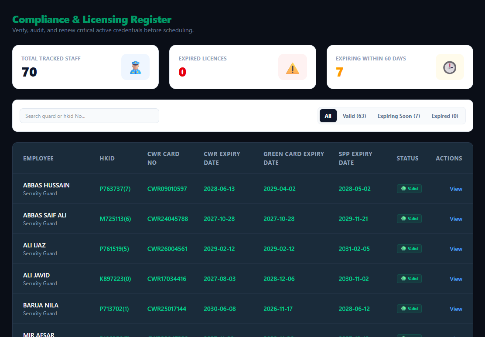
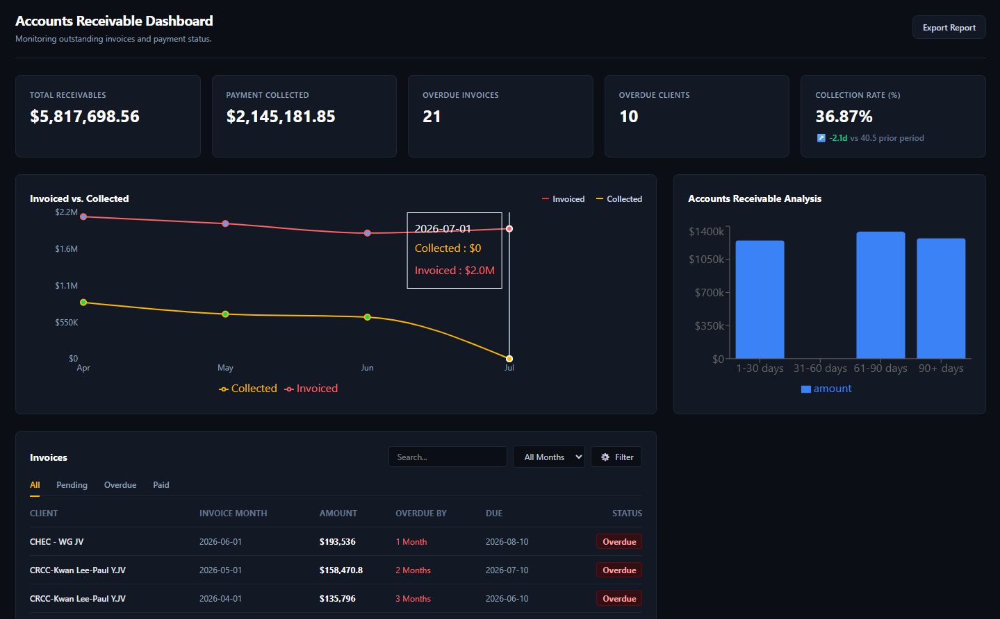
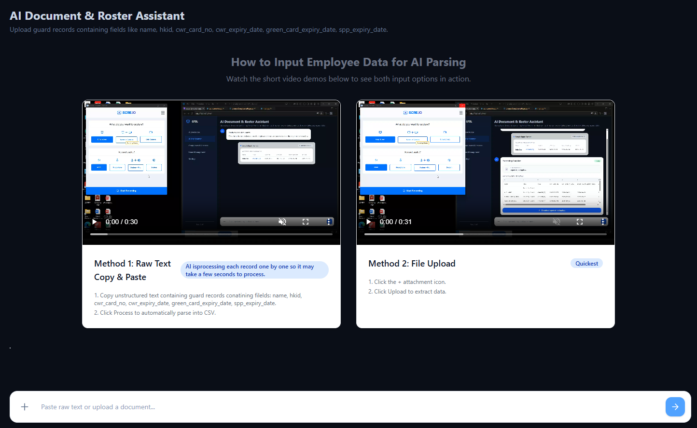
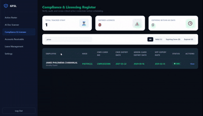

## Security Roster App Project Summary

This is a web-based security operations and workforce management application for managing security guards, licenses, client contracts, invoices, and document processing.

### Technology Stack

- Frontend: React 19 with Vite
- Routing: React Router
- Styling: Tailwind CSS and custom CSS
- Charts: Recharts
- Database and authentication: Supabase
- Backend: FastAPI with Python
- AI integration: DeepSeek API
- OCR/image processing: Pillow and AI-based extraction
- Scheduled notifications: APScheduler
- Deployment: Vercel frontend AND Render backend

### Main Features

#### 1. Authentication and Role-Based Access

- Users log in through Supabase authentication.
- The user’s role is loaded from the `users` table.
- Users with the `portal_admin` role can access the Accounts Receivable page.
- Unauthenticated users are redirected to `/login`.
- Authenticated users are redirected to `/roster`.
- Idle timeout functionality is included for automatic session protection.


Main Supabase tables:

- `employees`
- `invoices`
- `clients`

#### 2. License Compliance Management



Route:

```text
/licences
```

Features:

- Displays all tracked security personnel.
- Searches by employee name or HKID.
- Filters by:
  - All
  - Valid
  - Expiring Soon
  - Expired
- Calculates license status dynamically based on expiry dates.
- Tracks the following licenses:
  - CWR card
  - Green card
  - SPP
- Displays counts for total staff, expired licenses, and licenses expiring within 60 days.
- Includes pagination.
- Provides a detail drawer for individual guards.
- Supports document upload for license renewal or rescanning. (AI extracts the data from image)
- Shows license validity timelines.

#### 3. Accounts Receivable Dashboard



Route:

```text
/accounts
```

Access:

- Admin users only.

Features:

- Displays total receivables.
- Displays payment collected.
- Displays overdue invoice count.
- Displays overdue client count.
- Calculates collection rate.
- Displays an invoiced-versus-collected line chart.
- Displays an accounts receivable aging bar chart.
- Supports invoice search by client name.
- Supports invoice filtering by:
  - All
  - Pending
  - Overdue
  - Paid
- Supports filtering invoices by issue month.
- Includes client-side invoice pagination.
- Displays pagination status such as:

```text
Showing 1-7 of 156 invoices
```

- Includes previous, next, page-number, and ellipsis pagination controls.

Main Supabase tables:

- `invoices`
- `clients`

#### 4. AI Document and Roster Assistant



Route:

```text
/scan
```

Features:

- Allows users to upload documents or images.
- Allows users to paste raw text.
- Sends input to the FastAPI backend.
- Converts uploaded data or text into CSV format.
- Displays a data preview table.
- Allows the generated CSV file to be downloaded.
- Supports fields such as:
  - Name
  - HKID
  - CWR card number
  - CWR expiry date
  - Green card expiry date
  - SPP expiry date
- Includes an animated processing interface showing text being converted into CSV.

Frontend API request:

```text
POST /convert
```

#### 5. AI licence Scanner



Inside Route:

```text
/scan
```

Features:

- Allows users to upload an image.
- The LLM wil extract the required field nased on the image
- A confirmation will appear before updating the data

Frontend API request:

```text
POST /extract-data
```

#### 6. License Expiry Notifications

The backend checks employee license dates and identifies:

- Expired licenses
- Licenses expiring within 60 days

It can generate HTML email notifications containing:

- Employee name
- HKID
- License type
- Expiry status

The scheduled license check runs daily at:

```text
09:00 Hong Kong time
```

#### 7. Contract Expiry Notifications

The backend checks client contracts ending within approximately 30 days.

The notification includes:

- Client name
- Contract number
- Contract end date

The scheduled contract check runs daily at:

```text
09:30 Hong Kong time
```

#### 8. Backend API

Backend location:

```text
backend-ai/
```

Available endpoints:

```text
GET /
```

Checks whether the backend service is online.

```text
POST /convert
```

Converts uploaded files or raw text into a downloadable CSV file.

```text
POST /extract-data
```

Processes an uploaded license image and attempts to extract an expiry date using AI.

### Frontend Routes

```text
/login       Login page
/roster      Placeholder page for future use
/scan        AI document scanner
/licences    License compliance dashboard
/accounts    Accounts receivable dashboard
/leave       Placeholder page for future use
/settings    Placeholder page for future use
```

### Data Flow

1. The frontend authenticates users through Supabase.
2. React components query Supabase tables directly for operational data.
4. License statuses are calculated from employee expiry dates.
5. Documents and raw text are sent to the FastAPI backend.
6. The backend uses AI and conversion utilities to process documents.
7. APScheduler runs automated license and contract notification jobs.
8. Licenses can be updated from the client-side by uploading image of a licence


